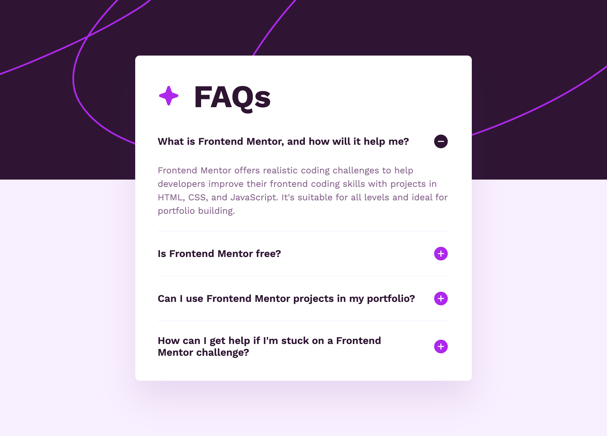

# Frontend Mentor - FAQ accordion solution

This is a solution to the [FAQ accordion challenge on Frontend Mentor](https://www.frontendmentor.io/challenges/faq-accordion-wyfFdeBwBz). Frontend Mentor challenges help you improve your coding skills by building realistic projects.

## Table of contents

- [Overview](#overview)
  - [The challenge](#the-challenge)
  - [Screenshot](#screenshot)
  - [Links](#links)
- [My process](#my-process)
  - [Built with](#built-with)
  - [Useful resources](#useful-resources)
- [Author](#author)

## Overview

### The challenge

Users should be able to:

- Hide/Show the answer to a question when the question is clicked
- Navigate the questions and hide/show answers using keyboard navigation alone
- View the optimal layout for the interface depending on their device's screen size
- See hover and focus states for all interactive elements on the page

### Screenshot

### Links

- Solution URL: [Github](https://github.com/dave-cross/Frontend-Mentor-faq-accordion-profile-solution)
- Live Site URL: [Github Pages](https://dave-cross.github.io/Frontend-Mentor-faq-accordion-profile-solution/)

## My process

### Built with

- Semantic HTML5 markup
- CSS custom properties
- Flexbox
- CSS Grid
- Deatils/Summary
- Mobile-first workflow
- NO JAVASCRIPT!

### Useful resources

- [Kevin Powell's Youtube](https://www.youtube.com/watch?v=Vzj3jSUbMtI) - This is where I learned the technique for animating `height: auto;` with CSS alone.
- [Details/Summary tags on MDN](https://developer.mozilla.org/en-US/docs/Web/HTML/Element/details) - The documentation.

## Author

- Youtube - [dave-cross](https://www.youtube.com/@dave-cross)
- Frontend Mentor - [@dave-cross](https://www.frontendmentor.io/profile/dave-cross)
